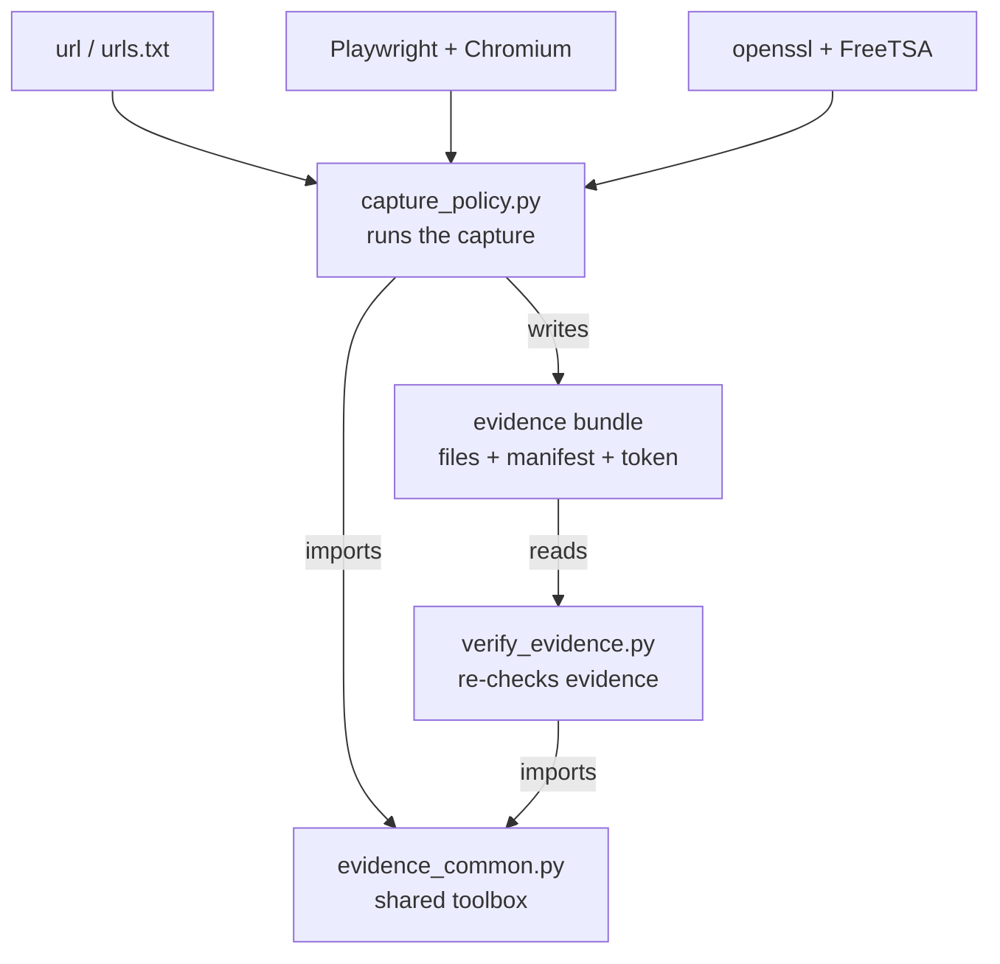

# Compliance Evidence Capture

A tool that takes a web page (for example, a company's privacy policy) and
produces **court-of-audit-ready proof** of what that page said and when — proof
that can't be secretly altered later. It runs fully automatically, and uses only
free, open-source tools.

---

## What it does

When a compliance team needs to prove "this is exactly what the privacy policy
said on this date," a normal screenshot isn't good enough — a screenshot and a
date on it can both be edited by anyone. This tool solves that in three steps:

1. **Captures** the page as a screenshot, a PDF, and the raw HTML.
2. **Fingerprints** every file with SHA-256 (a unique code — change one letter in
   the file and the code completely changes).
3. **Timestamps** those fingerprints with an independent authority (FreeTSA),
   which signs them with a trusted UTC time that can't be faked or back-dated.

The result is a bundle of evidence where **any later tampering is instantly
detectable**, and the capture time is vouched for by a third party — not by our
own computer's clock.

---

## Architecture

The pipeline, stage by stage:

```
   [ Trigger ]   run it manually  OR  on a schedule (CI)
        |
        v
   [ 1. CAPTURE ]   Playwright opens the page in a real (headless) browser
        |
        |--> screenshot.png       full-page image (kept pristine)
        |--> privacy-policy.pdf   PDF version of the page
        |--> page.html            the page's rendered HTML
        |--> response.json        HTTP status + key headers
        v
   [ 2. HASH ]   take a SHA-256 fingerprint of every file
        |
        v
   [ 3. MANIFEST ]   manifest.json  = one file listing all those fingerprints
        |
        v
   [ 4. TIMESTAMP ]   fingerprint the manifest, send it to FreeTSA,
        |             get back a signed RFC 3161 token (manifest.tsr)
        v
   [ 5. VERIFY ]   automatically re-check every fingerprint + the token.
        |           If anything is wrong, STOP and produce nothing (fail-closed).
        v
   [ 6. REPORT ]   report.html (easy to read) + receipt.json (machine summary)
```

How the modules connect:



`capture_policy.py` runs the capture (using Playwright and openssl + FreeTSA) and
imports the shared `evidence_common.py` toolbox. `verify_evidence.py` reads the
evidence bundle later and imports the same toolbox — so the capturer and the
auditor check evidence in exactly the same way.

### Why this proves integrity — the chain of trust

Each step is locked to the one below it by a fingerprint:

```
files  ->  SHA-256 of each file  ->  manifest.json  ->  SHA-256(manifest)  ->  RFC 3161 token
```

Change one byte of any file, and its fingerprint changes → the manifest's
fingerprint changes → it no longer matches the signed token. To fake the
evidence, someone would have to edit a file, rebuild the manifest, **and** forge
an independent authority's cryptographic signature — which is not feasible.

---

## What's in each evidence bundle

A single run creates `evidence/<run_id>/` (or one folder per URL for multi-URL runs):

| File | What it is |
|------|-----------|
| `screenshot.png` | Full-page screenshot, **kept exactly as captured** (this is what gets fingerprinted). |
| `screenshot_annotated.png` | A **copy** with a visible banner (URL / Captured UTC / Run ID) for humans. |
| `privacy-policy.pdf` | PDF version of the page, also fingerprinted. |
| `page.html` | The page's HTML as captured. |
| `response.json` | HTTP status, key headers, browser settings. |
| `manifest.json` | The list of all file fingerprints — the heart of the evidence. |
| `manifest.tsq` / `manifest.tsr` | The timestamp request and the signed RFC 3161 token. |
| `report.html` | A clean, human-readable report for auditors. |
| `receipt.json` | A short machine-readable summary of the run. |

> The two screenshots are intentional: the pristine one is the *evidence* (never
> altered before fingerprinting); the annotated one is a *readable copy*. Putting
> a banner on the evidence itself would change its fingerprint, so they're kept
> separate. `report.html` and `receipt.json` are convenient summaries, **not** the
> source of truth — the manifest and the timestamp token are.

---

## Setup (one time)

```bash
pip install -r requirements.txt
python -m playwright install chromium
```
`openssl` must be installed and on your PATH (used for the timestamp step).

## Run a capture

Single page:
```bash
python capture_policy.py --url "https://www.mindtickle.com/legal/privacy-policy/" --tsa-provider freetsa
```

Several pages at once (list them in `urls.txt`, one per line):
```bash
python capture_policy.py --urls-file urls.txt --tsa-provider freetsa
```

Useful switches: `--verbose` (show full technical detail), `--tsa-provider ""`
(skip the timestamp step — still produces screenshot, PDF and fingerprints).

## Verify evidence (anyone can re-check it later)

```bash
python verify_evidence.py evidence/<run_id>
```
Output:
```
[PASS] Screenshot integrity
[PASS] PDF integrity
[PASS] HTML integrity
[PASS] Metadata integrity
[PASS] Annotated screenshot integrity
[PASS] Manifest integrity
[PASS] Trusted timestamp verification
Overall Result: VERIFIED
```

## Prove tamper-detection works

Edit one character in any captured file, then re-run `verify_evidence.py`. That
file now shows `FAIL` and the overall result becomes `FAILED`. Undo the edit and
it passes again.

---

## Automation

`.github/workflows/compliance-capture.yml` runs the capture on a schedule and
saves the evidence as a retained CI artifact — so it can run week after week.

## Key design choices

- Uses a **real browser** (Playwright + Chromium), so the screenshot and PDF match
  what a person actually sees.
- The **pristine screenshot is never annotated** — the visible banner is a separate file.
- The timestamp authority's **CA certificate is pinned by fingerprint**, so it can't be swapped.
- The pipeline **fails closed** — it refuses to output evidence that doesn't verify.
- Reports are **derived views**, never the trust anchor.

For the full trust model, risk analysis, and compliance notes, see
[`SECURITY_REVIEW.md`](SECURITY_REVIEW.md).
